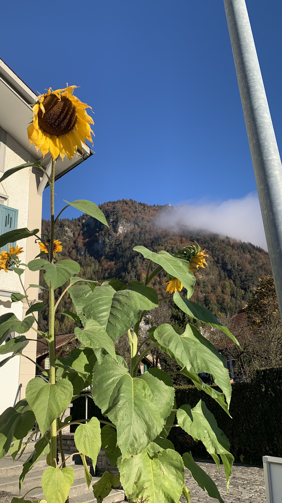
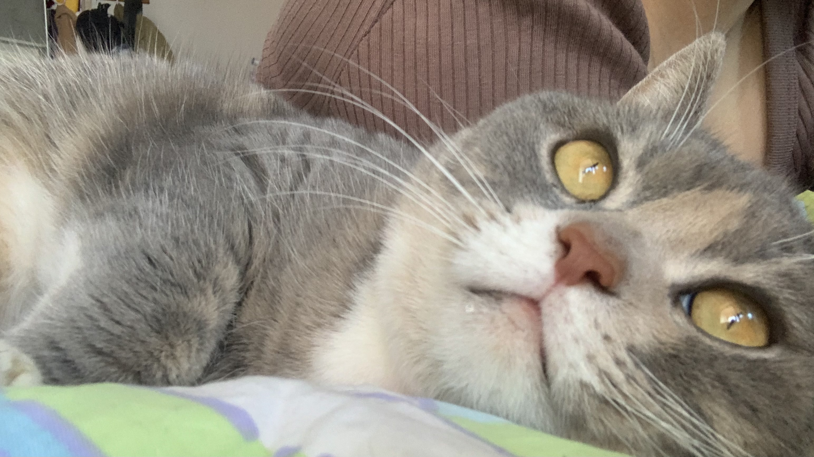

Hi!:waving_hand: My name is Anhui Gui. I graduated with a Master's degree in Digital Business from the [University of Amsterdam](https://www.uva.nl/en). Previously, I studied Computer Science (for 1 year), International Economics, and CPA in bacherlor's studies at [Jiangxi University of Finance and Economics](https://en.wikipedia.org/wiki/Jiangxi_University_of_Finance_and_Economics).

My research interest revolves around studying online information and user behaviour on social media. My goal is to promote the application of advanced machine learning techniques to gain a comprehensive understanding of the dynamics of user patterns and the underlying factors behind online data, with a focus on the mental health field. In my research, I integrate diverse perspectives from multiple disciplines, employing a range of machine learning algorithms and statistical methods to achieve a thorough comprehension of the subject matter.

<b>Here are some fun facts about me in personal life:grinning_cat::</b>
- Open-minded and always curious about new things
- Enjoy haphazard journeys
- Red pandas are too cute 
- Coffee and bubble tea are my go-to drinks
- Keen on reading and baking
- An enthusiastic video gamer (Dota2)
  
P.S. I am really into programming, and I believe that sharing knowledge can accelerate the development process. Therefore, I am writing beginner-friendly tutorials with more details from a learner’s perspective. And I also try to openly share my code whenever possible.


  
  
  
  
   
  
  
  


