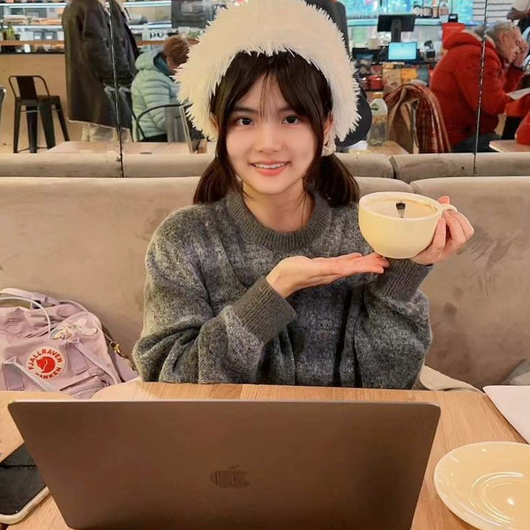

Hi!:waving_hand: My name is Anhui Gui. I graduated with a master's degree in <em>Business Administration: Digital Business</em> from the [University of Amsterdam](https://www.uva.nl/en). Previously, I studied <em>Computer Science: Financial Big Data Analysis</em> (for 1 year), <em>International Economics and Trade</em>, and <em>Accounting: CPA</em> during bachelor's studies at [Jiangxi University of Finance and Economics](https://en.wikipedia.org/wiki/Jiangxi_University_of_Finance_and_Economics).

I really love weaving data into actionable insights through programming; the spark of bringing ideas into reality with lines of code is so exhilarating. Therefore, I am always on the journey of exploration and trying to share my code and ideas whenever possible. I also hope that I can bring some positive impact to our world by applying my knowledge and skills in my research.

<h3>Here are some fun facts about me in my daily life:</h3>

- Open-minded and always curious about new things
- Enjoy nature and haphazard journeys
- Red pandas are too cute 
- Keen on baking and reading
- An enthusiastic video gamer (Dota2)

<h3>My Inspirational Words of Motivation:</h3>

<em>"A job well done is its own reward. You take pride in the things you do, not for others to see, not for the respect, or glory, or any other rewards it might bring. You take pride in what you do, because you are doing your best. If you believe in something, you stick with it. When things get difficult, you try harder."</em>


<!--

  
  
  
  
   
  
  
  



<!--
My research focuses on advancing the application of state-of-the-art machine learning techniques to comprehensively understand dynamic user patterns and the underlying factors in online data from digital platforms. In my research, I integrate expertise and knowledge from data science, business, and social science and utilise various NLP/LLMs and statistical methods to gain a thorough understanding of the subject.
-->