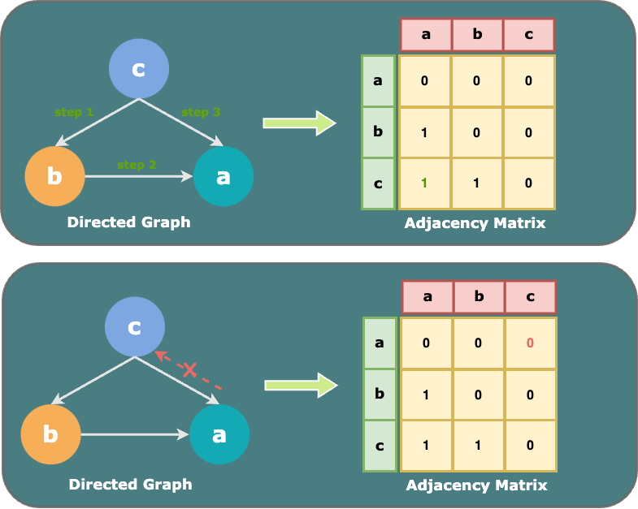

+++
title = 'Optimise Tideman Algorithm Using Bitwise Operations'
date = 2024-01-09T17:36:18+01:00
draft = false
slug = 'bitwise-operators' 
tags = [ 'tideman', 'graph theory', 'bitwise operation', 'adjacency list', 'adjacency matrix', 'C', 'summary']
series_order = 2
+++


The adjacency matrix is a square matrix used to represent a finite graph in graph theory. However, it can be space-consuming for sparse graphs. This article incorporates bitwise operations into the application of the adjacency matrix in the Tideman voting algorithm and achieves O(n) and Ω(1) for finding the winners. Importantly, it also condenses the processes of locking pairs and finding winners into a concise 10 lines of code while optimising memory usage to only \\(\(\frac{4}{n}\)\\) of the adjacency matrix.


This article will first introduce the background of the **Tideman algorithm** to enable readers who are not yet familiar with this method to build a comprehensive understanding of the context. Subsequently, it will demonstrate all the main functions of this algorithm. If you are already comfortable with the prerequisite concepts of Tideman, please feel free to jump to the [core discussion part](#chapter-2-4) directly.


## 1. Background of the Tideman Electoral System

### 1.1. Definition
The **Tideman (aka. Ranked pairs) algorithm** is an electoral system developed in 1987 by [Nicolaus Tideman](https://en.wikipedia.org/wiki/Nicolaus_Tideman "Nicolaus Tideman") that selects a single winner using votes that express [preferences](https://en.wikipedia.org/wiki/Ranked_voting "Ranked voting") [^1][^2]. It is a ranked-choice voting system where voters can vote for more than one candidate in order of preference. A “Condorcet winner”, the person who would have won any head-to-head matchup against another candidate, will be elected from a sorted list of winners in such a system.

### 1.2. Procedure
The Tideman voting method operates as follows:
1. **Tally**: Document the winner of each pair of candidates and the margin.
2. **Sort**: Rank each pair, by strength of victory (margin) from largest first to smallest last.
3. **Lock**: Starting with the strongest pair, go through the sorted pairs, and "lock" the pairs that do not create a cycle with the existing locked-in pairs. 
4. **Find**: The winner in such a voting system is defined as a person who never appears as a loser in each head-to-head matchup.

### 1.3. Visualisation
To enhance clarity, consider this straightforward example for a more comprehensive comprehension.

**Tally**: Suppose that there are 3 candidates {a, b, c} and 10 voters, such that the votes are tallied as shown in [Table 1](#table1).
<a name="table1"></a>
<p align="center">
<em>Table 1. Table of Ballots</em>
</p>

|   | a | b | c |
|:-:|:-:|:-:|:-:|
| a | 0 | 2 | 6 |
| b | 8 | 0 | 1 |
| c | 4 | 9 | 0 |

**Sort**: The pairs are then sorted in decreasing order by strength of victory.
<a name="table2"></a>
<p align="center">
<em>Table 2. Sorted Pairs</em>
</p>

|   | winner | loser | strength |
|:-:|:------:|:-----:|:--------:|
| 1 |    c   |   b   |     9    |
| 2 |    b   |   a   |     8    |
| 3 |    a   |   c   |     6    |

**Lock**: In this step, the Tideman algorithm locks the pairs from the strongest strength and avoids creating cycles. To represent this, we can create a matrix with all the initial values set as "0", and then use "1" to represent "locked" pairs. 
<a name="table3"></a>
<p align="center">
<em>Table 3. Locked Pairs</em>
</p>

|   | a | b | c |
|:-:|:-:|:-:|:-:|
| a | 0 | 0 | 0 |
| b | 1 | 0 | 0 |
| c | 0 | 1 | 0 |

**Candidate graph**<br>
The aforementioned procedure can be illustrated through graphs containing nodes and arrows representing edges. In particular,  a node is a candidate, and an edge from candidate a to candidate b indicates that candidate a wins against candidate b in a head-to-head matchup. The matchup edges are “locked” to the graph one at a time, based on the sorted order without creating a cycle. If a cycle is anticipated, the corresponding pair will be omitted.

The graph representing the above process is depicted in [Figure 1](candidate-graph.png). According to the Tideman method, the winner of the election is the candidate who never appears as a "loser"; consequently, s/he should be the "source" of the graph with no arrows pointing towards him/her. Therefore, candidate c is considered the winner.

<p align="center">
<em>Figure 1. Directed Graph</em>
</p>


## 2. Build the Tideman Electoral System in C
The crucial steps in the Tideman method include 6 functions: `vote`, `record_preferences`,`add_pairs`, `sort_pairs`, `lock_pairs`, and `print_winner`.

### 2.1. Record Votes
The `vote` function collects ballots from voters and ensures their validity by verifying if the names appear in the `candidate` list. Afterwards, it proceeds to record the votes.

Following the voting process, the `record_preference` function generates pairs of winners and losers, counting the occurrences of each pair in the `preference` array. For example, `preference[i][j] = 3` indicates that there are 3 voters that prefer candidate i over candidate j.

```c
bool vote(int rank, string name, int ranks[])
{
    for (int i = 0; i < candidate_count; i++)
    {
        if (strcmp(name, candidates[i]) == 0)
        {
            ranks[rank] = i;
            return true;
        }
    }
    return false;
}
```
```c
void record_preferences(int ranks[])
{
    for (int i = 0; i < candidate_count; i++)
    {
        for (int j = i + 1; j < candidate_count; j++)
        {
                preferences[ranks[i]][ranks[j]]++;
        }
    }
    return;
}
```


### 2.2. Add Pairs
The `add_pairs` function will add all pairs with more votes which means one candidate is preferred over the other among all voters.
For example, if `preferences[m][n] = 3` and `preferences[n][m] = 2` means more voters prefer m over n, so the pair `m -> n` will be added to the `pairs` by assigning m as `.winner` and n as `.loser`. If the candidates are tied, they will not be added to the array.

```c
void add_pairs(void)
{
    int i = 0;
    pair_count = 0;
    for (int m = 0; m < candidate_count; m++)
    {
        for (int n = 0; n < candidate_count; n++)
        {
            if (preferences[m][n] > preferences[n][m])
            {
                pairs[i].winner = m;
                pairs[i].loser = n;
                pair_count++;
                i++;
            }
        }
    }
}
```

### 2.3. Sort Pairs
The `sort_pairs` function sorts the pairs of candidates in `pairs` in decreasing order based on the strength of victory.

```c
void sort_pairs(void)
{
    for (int i = 0; i < pair_count - 1; i++)
    {
        for (int j = 0; j <= i - 1; j++)
        {
            if ((preferences[pairs[j].winner][pairs[j].loser]) < (preferences[pairs[j + 1].winner][pairs[j + 1].loser]))
            {
                pair temp = pairs[j];
                pairs[j] = pairs[j + i];
                pairs[j + 1] = temp;
            }
        }
    }
    return;
}
```
  
### 2.4. Lock Pairs {#chapter-2-4}
The `lock_pairs` function creates the locked graph by adding all pairs in decreasing order of victory strength while ensuring that each edge does not create a cycle. In this section, three methods are discussed for implementing the `lock_pairs` function. 

This is the most fun part of this algorithm! Initially, I employed a very cumbersome method involving numerous embedded loops. After exploring together with Juju, we adopted the bitwise operation method and successfully locked pairs without creating a cycle and find the winner with 10 lines of code in total and achieved O(n) and Ω(1), while also optimising memory usage by \\(\(\frac{n-4}{n}\)\\) comparing to the adjacency matrix method.


#### 2.4.1. Adjacency List Method 
An **adjacency list** is a data structure used to represent a finite [graph](https://en.wikipedia.org/wiki/Graph_(discrete_mathematics) "Graph (discrete mathematics)"). Each list within an adjacency list describes the set of neighbours of a particular [vertex](https://en.wikipedia.org/wiki/Vertex_(graph_theory) "Vertex (graph theory)") in the graph [^3]. 

In the context of Tideman, new pairs are locked in the order of sorted rankings, while ensuring that the newly locked-in pairs do not create a cycle. Transitioning to the concept of the adjacency list, to prevent the creation of cycles with newly added pairs, the following steps should be taken:
1. Link all existing pairs. For instance, if we have pairs {c, b} and {b, a}, we should also link {c, a}. Therefore, [Figure 1.](candidate-graph.png) can be described by the set of adjacency lists: `{c -> [b, a], b -> [a], a -> []}` as shown in [Figure 2](adjacency-list.png).
   
<p align="center">
<em>Figure 2. Adjacency List</em>
</p>


2. Verify if the reverse pair of the new pair already exists. For example, when considering a new pair {a, c}, before locking it, we need to check if {c, a} already exists. If so, it would create a cycle, and the pair {c, a} should be skipped.
   
<p align="center">
<em>Figure 3. Skip Pair to Avoid Creating Cycle</em>
</p>


<br>


The skeleton of implementing the Tideman algorithm using the adjacency list concept can be summarised in the following steps:
1. Create a new empty list `NEW` to document all the connections within locked pairs.
2. Iterate through all the pairs in `pairs`:
   - Check if the new pair will create a cycle with existing connections in `NEW`. If not:
       - Lock the new pair in `locked` and add this pair in `NEW`.
       - For each newly added pair, update all the connections in `NEW`. To build the connection, simply check if the winner of the new pair ever appeared as the loser in the previous pair, and update the new connections by adding them to the list `NEW`.


When creating new connections (links), make sure to skip duplicated pairs to prevent exceeding the size of the array.


```c
void lock_pairs(void)
{
    int size = MAX * (MAX - 1);
    int j = 0;
    pair NEW[size];

    for (int n = 0; n < pair_count; n++)
    {
        int flag = 0;
        for (int i = 0; i <= j; i++)
        {
            if (pairs[n].winner == NEW[i].loser && pairs[n].loser == NEW[i].winner)
            {
                flag = 1;
                break;
            }
        }
        if (flag != 1)
        {
            locked[pairs[n].winner][pairs[n].loser] = true;

            NEW[j].winner = pairs[n].winner;
            NEW[j].loser = pairs[n].loser;
            int achor = j;
            j++;

            for (int m = achor; m < j; m++)
            {
                for (int k = 0; k < achor; k++)
                {
                    if (NEW[m].winner == NEW[k].loser)
                    {
                        for (int a = 0; a < achor; a++)
                        {
                            if (NEW[a].winner == NEW[k].winner && NEW[a].loser == NEW[m].loser)
                            {
                                flag = 1;
                                break;
                            }
                        }
                        if (flag != 1)
                        {
                            NEW[j].winner = NEW[k].winner;
                            NEW[j].loser = NEW[m].loser;
                            j++;
                            flag = 0;
                        }
                    }
                }
            }
        }
    }
}
```

#### 2.4.2. Adjacency Matrix Method
The adjacency matrix is a [square matrix](https://en.wikipedia.org/wiki/Square_matrix "Square matrix") used to represent a finite [graph](https://en.wikipedia.org/wiki/Graph_(discrete_mathematics) "Graph (discrete mathematics)"). The elements of the [matrix](https://en.wikipedia.org/wiki/Matrix_(mathematics) "Matrix (mathematics)") are boolean variables indicating whether pairs of [vertices](https://en.wikipedia.org/wiki/Vertex_(graph_theory) "Vertex (graph theory)") are [adjacent](https://en.wikipedia.org/wiki/Neighbourhood_(graph_theory) "Neighbourhood (graph theory)") in the graph [^4]. This concise representation allows the adjacency matrix to portray the graph straightforwardly. However, for a sparse graph, an adjacency matrix may require more space compared to an adjacency list since it also allocates space to nonexistent edges.

The concept of building the Tideman algorithm using the adjacency matrix is similar to that of the adjacency list: lock every new pair that will not create a cycle in `locked`, and then connect all the links for the newly added pair in an adjacency matrix. 
<p align="center">
<em>Figure 4. Adjacency Matrix</em>
</p>



The skeleton of implementing the Tideman algorithm using the adjacency list concept can be summarised in the following steps:
1. Create a new empty matrix `NEW` to document all the connections within locked pairs.
2. Iterate through all the pairs in `pairs`:
	- Check if the new pair will create a cycle with existing connections in `NEW` by checking if the reverse pair is `true` in the matrix. If not:
      - Lock the new pair in `locked` and add this pair in `NEW`.
      - For each newly added pair, update all the connections in `NEW`. To build the connection, simply iterate all raws and use `Logical OR` to accept all the `true`s from `NEW[j][winner]`(j that wins over the winner) to `NEW[loser]` (given that `winner -> loser` and `j -> winner`, we can conclude that `winner -> loser`).

```c
void lock_pairs(void)
{
    bool NEW[MAX][MAX] = {{}};

    for (int i = 0; i < pair_count; i++)
    {
        if (!NEW[pairs[i].loser][pairs[i].winner])
        {
            locked[pairs[i].winner][pairs[i].loser] = true;
            NEW[pairs[i].winner][pairs[i].loser] = true;
            for (int j = 0; j < candidate_count; j++)
            {
                NEW[j][pairs[i].loser] |= NEW[j][pairs[i].winner];
            }
        }
    }
}
```

#### 2.4.3. Bitwise Operation Method
Although the adjacency matrix is very straightforward, a concern arises when applying it to a graph with sparse connections, resulting in a matrix predominantly filled with `0` and a scarcity of `1`. To optimise memory usage and reduce the average running time that the algorithm takes to find the winners, bitwise operations are incorporated in this section.

A **bitwise operation** operates on a [bit string](https://en.wikipedia.org/wiki/Bit_string "Bit string"), a [bit array](https://en.wikipedia.org/wiki/Bit_array "Bit array") or a [binary numeral](https://en.wikipedia.org/wiki/Binary_numeral_system "Binary numeral system") (considered as a bit string) at the level of its individual [bits](https://en.wikipedia.org/wiki/Bit "Bit") [^5]. Bitwise operations commonly use less power because of the reduced use of resources [^6]. Here is the list of all the bitwise operators with examples.
- `&`  **Bitwise AND**: Conduct AND on every bit of two numbers.<br>
    `int result = 5 & 3; // 101 & 011 -> 001`
- `|`  **Bitwise OR**: Conduct OR on every bit of two numbers.<br>
    `int result = 5 | 3; // 101 & 011 -> 111`
- `^`  **Bitwise XOR**: Take 2 numbers, and set different bits as 1, same set as 0.<br>
    `int result = 5 ^ 3; // 101 & 011 -> 110`
- `~` **Bitwise NOT**: Inverts all bits in a number.<br>
    `int result = ~5; // 0000 0000 0000 0000 0000 0000 0000 0101 -> 1111 1111 1111 1111 1111 1111 1111 1010`
- `<<`  **Left shift**: Shifts the bits of the first operand to the left by the number of positions specified by the second operand.<br>
    `int result = 5 << 2; // 101 << 10100`
- `>>`  **Right shift**: Shifts the bits of the first operand to the right by the number of positions specified by the second operand.<br>
    `int result = 20 >> 3; // 10100 >> 10`

In the context of tideman, pair `{pair[i].winner,pair[i].loser}` will represent as winner<sup>th</sup> bit in the binary format of `NEW[pair[i].loser]`. We can use `1 << n` to represent n<sup>th</sup> bit of `NEW[i]` (e.g.: `1 << 2` = `100`, which sets the 2<sup>th</sup> bit to 1). We can use `&` to check if n<sup>th</sup> bit is `0` or `1` and use `|` to set n<sup>th</sup> bit to `1`.

<p align="center">
<em>Figure 5. Bitwise Operations with Examples</em>
</p>


<br>
The skeleton of implementing the Tideman algorithm incorporating the bitwise operations can be summarised in the following steps:

1. Create a new empty array `NEW` with the size of the maximum candidate count and initialise all elements of the array to `0`.
2. Iterate through all the pairs in `pairs`:
	- Use `&` to check if the new pair will create a cycle with existing connections in `NEW` by verifying if the loser<sup>th</sup> bit of the winner<sup>th</sup> item in `NEW` already exists. If not, lock the new pair in `locked` and add this pair and all connections in `NEW` using `|=`.
```c
void lock_pairs(void)
{
    int NEW[MAX] = {};
    for (int i = 0; i < pair_count; i++)
    {
        if (!(NEW[pairs[i].winner] & (1 << pairs[i].loser)))
        {
            locked[pairs[i].winner][pairs[i].loser] = true;
            NEW[pairs[i].loser] |= ((1 << pairs[i].winner) | NEW[pairs[i].winner]);
        }
    }
}
```

### 2.5. Find the Winner

#### 2.5.1. Find the Winner with Adjacency List and Adjacency Matrix
The `print_winner` function will print out the names of the candidates who are the winners under Tideman algorithm. The winners should be the "source" of the graph meaning that no arrows point to them. 

For the adjacency list and adjacency matrix method, the `print_winner` checks every `loser` column in `locked`, and breaks if meets any `true` (which means this candidate was a loser in a pair).
```c
void print_winner(void)
{
    for (int j = 0; j < candidate_count; j++)
    {
        bool is_winner = true;
        for (int i = 0; i < candidate_count; i++)
        {
            if (locked[i][j])
            {
                is_winner = false;
                break;
            }
        }
        if (is_winner)
        {
            printf("%s\n", candidates[j]);
        }
    }
}
```

#### 2.5.1. Find the Winner Using Bitwise Operation
For the bitwise operation method, `print_winner` just needs to simply find all the `0`s in the array `NEW`.
```c
void print_winner(void)
{
    for (int k = 0; k < candidate_count; k++)
    {
        if (NEW[k] == 0)
        {
            printf("%s\n", candidates[k]);
        }
    }
}
```

Combining the `lock_pairs` and `print_winner` together, here is all we need using the bitwise operations to find the winners.

```c
void find_winners(void)
{
    int NEW[MAX] = {};
    for (int i = 0; i < pair_count; i++)
    {
        if (!(NEW[pairs[i].winner] & (1 << pairs[i].loser)))
        {
            locked[pairs[i].winner][pairs[i].loser] = true;
            NEW[pairs[i].loser] |= ((1 << pairs[i].winner) | NEW[pairs[i].winner]);
        }
    }
 
    for (int k = 0; k < candidate_count; k++)
    {
        if (NEW[k] == 0)
        {
            printf("%s\n", candidates[k]);
        }
    }
}


```

I hope this article is enjoyable and helpful. Also, a big thanks to Juju for making the exploration journey so much fun, and CS50 staff for bringing us such an amazing [exercise](https://cs50.harvard.edu/x/2020/psets/3/tideman/)!

<div style="display:flex; gap:6px">
 tideman 

 graph theory 

 bitwise operation 

 adjacency list 

 adjacency matrix 

 c 

 summary 

</div>

  

[^1]: Tideman, T. N. (1987). Independence of clones as a criterion for voting rules. _Social Choice and Welfare_, _4_, 185-206.
[^2]: Schulze, M. (2011). A new monotonic, clone-independent, reversal symmetric, and condorcet-consistent single-winner election method. _Social choice and Welfare_, _36_, 267-303.
[^3]: https://en.wikipedia.org/wiki/Adjacency_list
[^4]: https://en.wikipedia.org/wiki/Adjacency_matrix
[^5]: https://en.wikipedia.org/wiki/Bitwise_operation
[^6]: "CMicrotek Low-power Design Blog". CMicrotek. Retrieved 2015-08-12.


