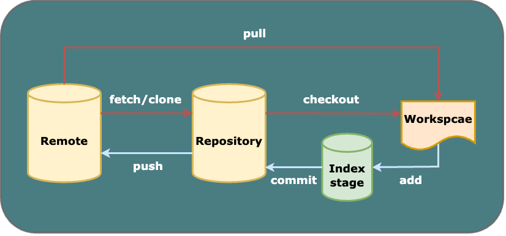
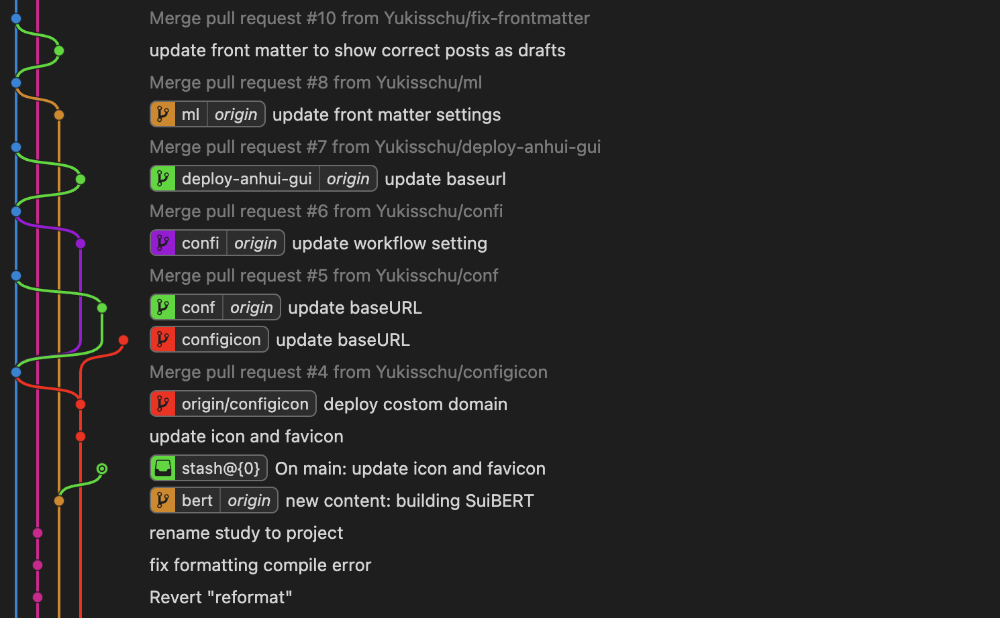

+++
title = 'Basic Git Jargon and Commands'
date = 2023-11-23T17:36:18+01:00
draft = false
slug = 'git-commands' 
tags = [ 'git', 'summary']
series_order = 2
+++


When I asked Juju "What are your favourite parts of programming?" Git was one of the answers I received. It is so **powerful** yet **concise** that it leads me to write this blog. From here you can find the very plain explanations of Git jargon and the most commonly used commands. 

The main concepts come from [Learn Git Branching](https://learngitbranching.js.org/), which is also recommended by Juju. It is a very fun website that visualises Git operations and helps beginners understand Git in a highly interactive and effective way. Most importantly, it does not require an internet connection. It became my good pal during travels in Switzerland when I had no internet on the train! :P

This blog will be regularly updated with fresh insights and newfound knowledge about Git. 


## 1. What is Git

Before delving into the details, let's first have a general understanding of Git.

### 1.1. The Definition and Usage of Git
Git is a free and open-source distributed **version control system** designed to handle everything from a small file to very large projects with speed and efficiency [^1]. To understand it better, for now we can simply think about the "Version history" function in the Google Document but with more add-ons. 

Git sounds very simple according to its definition, but it is also very versatile. The most common use case is to be used for collaborative software development. Its powerful version control functions allow multiple contributors to work on the same project simultaneously, without interfering with the main project until the changes are ready to be merged.
 
For personal usage, it can be used to make the work more flexible by tracing back to different versions or developing different features on a project at the same time. Generally, it is always useful if you want to contribute to or try some repositories on GitHub.

### 1.2. Basic Elements of Git
[Table 1.2.1.](#table1) provides definitions for some pieces of common Git jargon. Developing a general understanding of these terms before diving into the commands will make the subsequent sections more friendly.

  
<em>Table 1.2.1. Brief Introductions of Git Jargon</em>

|    **Jagon**    | **Brief Explanation**                                                                                                                                                                                                                                             |
|:---------------:|-------------------------------------------------------------------------------------------------------------------------------------------------------------------------------------------------------------------------------------------------------------------|
|  **Repository** | (aka. repo) a storage space with all files and version history related to the project                                                                                                                                                                                         |
|    **Remote**   | a storage space on a remote server (like GitHub) that is connected to another repository                                                                                              |
|  **Workspace**  | (aka. Working Directory) it holds the actual files on the disk of our laptop                                                                                                                                                                                      |
|    **Commit**   | a snapshot of the project at the time you submit your changes                                                                                                                                                                                                     |
|     **Add**     | stages changes that are ready for the commit (tell Git what changes you want to include)                                                                                                                                                                          |
| **Index stage** | an intermediate area between the workspace and the repository for holding the "added" changes                                                                                                                                                                     |
|    **Clone**    | creates a copy of a repository to local (like our laptops)                                                                                                                                                                                                        |
|    **Branch**   | a parallel line of development within a repository                                                                                                                                                                                                                |
|    **Merge**    | combine changes from different branches by createing a new commit that has both branch histories                                                                                                                                                                  |
|    **Rebase**   | combine a sequence of commits (a branch) to a new base commit (branch) by rewriting the commit history                                                                                                                                                            |
|   **Checkout**  | switch between branches or commits                                                                                                                                                                                                                                |
|     **HEAD**    | a pointer to the latest commit in the currently checked-out branch, and can be redirected manually                                                                                                                                                                |
|    **Fetch**    | retrieves changes from a remote repository to local but doesn't automatically merge them into your local branch                                                                                                                                                   |
|     **Pull**    | fetch remote changes and then merge them (pull request (PR) is a very common word on GitHub. It is used to propose the changes that have been made to a repository and request the repository owner to review the changes and integrate them into the repository) |
|     **Push**    | uploads the local changes to a remote repository                                                                                                                                                                                                                  |

[Figure 1.2.1.](git-relat.png) explains the basic relationships between each basic Git element. The interplay between them will be more clear as we explore deeper into Git.

  
<em>Figure 1.2.1. Relationships between Git Elements</em>

## 2. Basic Local Git Commands

Let's first look at what local Git can do. Without using the remote repository, Git can still provide a range of version control and collaboration features at the local level.

### 2.1. Creating New Things: Commit and Branch 
<u>***Concepts:***</u> 
**Commit**: Snapshots of the project. 
**Stage**: a holding area, use stage to select the changes you want to commit (after making many changes to your current file, you might just want to commit some of them). 
**Branch**: Pointers to a specific commit, including the work of this commit and all parent commits. 

<u>***Commands:***</u> 
`git commit`: make a new commit  
`git branch bugFix`: create a new branch named `bugFix`  
`git checkout bugFix`: put us on the branch `bugFix` 
`git checkout -b bugFix`: create a new branch `bugFix` and check out `bugFix` 

### 2.2. Moving Around: HEAD, ^ and ~

<u>***Concepts:***</u> 
**HEAD**: Currently checked out commit (always points to the most recent commit on this branch by default). 
**Detach HEAD**: Attach it to a commit instead of a branch. 
**Relative refs**: Start with somewhere memorable and work from there. 

<u>***Commands:***</u> 
`git checkout C1`: Detach HEAD, from `HEAD -> main -> C1` to `HEAD -> C1` 

In the "detached HEAD" state, you are not on a branch but at a specific commit.
 
`~<num>`: move the pointer from current location upwards a \<number> of times 
`git checkout main~2`: move upwards 2 commits (the grandparent of `main`) 
`^`: move upwards 1 commit (find the parent of the specified commit) 
`git checkout main^^`: move upwards 2 commits (the grandparent of `main`) 


The `^` modifier also accepts an optional number after it, which specifies which parent reference to follow from a merge commit.
 
`git checkout main^2`: checkout the second parent from a merged commit point, we can even chain them together with `git checkout HEAD~^2~2`. But this will only move around `HEAD`, if we want to move the branch around: `git branch bugFix main~^2~1` 
`git log`: a history record, showing all the changes or commits made in your project (recent --> earliest) 

### 2.3. Redesigning Branches: Merge, Squash, Rebase, and Cherry-pick
<u>***Concepts:***</u> 
**Merge**: Create a special commit that has two unique parents. "I want to include all the work from this parent over here and this one over here, *and* the set of all their parents". 
**Squash**: Combine multiple commits into a single commit. 
**Rebase**: Combine work between branches by making a nice linear sequence of commits. Copy a set of commits and plop them down somewhere else. 
**Interactive rebasing**: Open up a UI to show you which commits (with their commit hashes and messages) are about to be copied to rebase. Before rebasing, you can:
- reorder commits by changing their order in the UI
- toggle of the `pick` button of the specific commits to drop them 
  
**Cherry-pick**: Select a series of commits according to your demands below the `HEAD`. 

<u>***Commands:***</u> 
`git merge bugFix`: merge `bugFix` to `main`(checked out) 
`git rebase main`: move the work from `bugFix`(checked out) directly onto the `main` 
`git rebase main bugFix`: rebase `bugFix` onto `main` 

Please pay attention to the difference between **merge** and **rebase**. Assume we are currently checked out on `main`: 
`git merge A`: merge `A` to `main` 
`git rebase A`: rebase `main` onto `A`


`git branch -f main HEAD~3`: move (by force) `main` to 3 parents behind current `HEAD` 
`git branch -f main C2`: move (by force) `main` to `C2` (a commit) 
`git rebase -i HEAD~4`: rebase the commits until 3 beforehand the `HEAD` (4 in total including `HEAD`) on to `main` 
`git rebase -i bugFix`: rebase the selected/reordered commits to `bugFix` 
`git cherry-pick C1 C2`: copy C1, C2 below current location (`HEAD`) 

### 2.4. Undoing the Changes: Reset and Revert
Undo the previous steps on the local or remote branches. 

`git reset HEAD~1`: reverses changes by moving a branch reference backwards in time to one older commit before HEAD. 
`git revert HEAD`: reverse changes by creating a new commit that introduces changes that exactly reverse the commit. 

The ways of undoing changes using **reset** and **revert** are different. 
By moving the branch pointer to the previous commit, *reset* rewrites the history. 
While *revert* creates a new commit that undoes the changes introduced by a previous commit (safer for shared branches in teamwork).
 

### 2.5. Marking Commits: Git Tags

**Permanently** mark certain **commits** as "milestones" (major releases and big merges) that you can then reference like a branch. You can't commit directly to the `v1` tag.

`git tag v1 C1`: name the commit `C1` with the tag `v1` (if you leave the C1 off, git will just use whatever `HEAD` is at). 


`git checkout v1` is equal to `git checkout C1` 


`git describe`: describe where you are relative to the closest "anchor" (aka tag). Git describe takes the form of: `git describe <ref>`, where `<ref>` is anything Git can resolve into a commit. If you don't specify a ref, git just uses where you're checked out right now (`HEAD`).

The output of the command looks like `<tag>_<numCommits>_g<hash>`, where `tag` is the closest ancestor tag in history, `numCommits` is how many commits away that tag is, `g` stands for "git", and `<hash>` is the hash of the commit being described. 

For example, if your current commit is 3 commits away from the nearest tag named v1, and the hash of your current commit is abcdefg, the output might look like `v1_3_gabcdefg`.

So far, we have covered the fundamental **local Git commands**. Take a moment to revisit the [Git elements relationship graph](git-relat.png), and you would likely gain a deeper understanding of these concepts.

## 3. Basic Remote Git Commands
In this section, our exploration of Git will broaden to include the remote aspect. Leveraging a remote repository in Git enhances the efficiency and collaborative experience of software development, particularly in team-based and distributed environments. 

<u>***Concepts:***</u> 
**Remote repository**: Copies of your repository that are hosted on a server or another location, which allows commits to be transferred back and forth when multiple developers are working on a project together. 
**Remote branch**: A branch in our **local repository**. It is created to track the branch in the remote repository (aka. remote-tracking branch), helping understand the difference between local work and work on the remote. It is often named with a prefix indicating the name of the remote repository (`<remote name>/<branch name>`). For example, `origin/main` represents the `main` branch on the `origin` remote repository.


`remote branch` is only for tracking purposes, we do not work on these branches directly. Instead, we can push the changes to the remote repository (after pulling changes from the remote repository, the remote branches will be updated automatically).


### 3.1. Iteracting between Local and Remote: Clone, Fetch, Pull, and Push

#### 3.1.1 From Remote to Local
`git clone`: create local copies of the remote repository (from Github for example) 
`git fetch`: download the changes from a remote repository, but it **will not update** the branch you are currently working on. Specifically, it will:
- downloads the commits that the remote has but are missing from our local repository
- updates the remote branches (`origin/main`) to reflect the changes
- you can inspect/merge them to your local branch manually with `git merge`, `git rebase`, etc.
`git pull`: `fetch` remote changes and then `merge` them in one go.
`git pull --rebase`: shorthand for a pull and a rebase. Fetching changes from a remote repository and rebasing local changes on top of the fetched changes to solve the problems of diverged history.

#### 3.1.1 From Local to Remote
`git push`: upload local changes to the remote repository. 

The connection between `main` and `origin/main`:
- Pull: commits are downloaded onto `origin/main` and then merged into the local `main` branch.
- Push: work from the local `main` branch is pushed onto the remote's `main` branch, then represented by `origin/main` locally.


When collaborating in a large team, remote `main` is always protected. We need to work on `side branches` (off of `main`), and then create a pull request to merge the `side branches` onto `main`.


### 3.2. Enhanced Custom Interactions between Local and Remote

By default, the source and destination for both local and remote operations are the same in Git. However, Git is highly flexible, allowing you to customize these arguments as needed. 

#### 3.2.1. Customizing Upstream Branches 

`git branch -u origin/main side`: set the `side` branch to track `origin/main`
- If `side` is currently checked out: `git branch -u origin/main`
  
`git checkout -b side origin/main`: we can also start with creating a new branch named `side`, and then set it to track `origin/main`

#### 3.2.2. Customizing the Changes for Updates
**Push** 
`git push <remote> <place>`: git push can optionally take arguments, and it totally ignores where we are checked out.  
e.g.: `git push origin main`: Go to the `main` branch in my repository, grab all the commits, and then go to the `main` branch on the `origin` remote repository. Place whatever commits are missing on that branch. 

When the source and destination of the push are different: 
`git push origin <source>:<destination>`: `source` is any location on the local repository that git will understand. `destination` is the branch on the remote repository named origin, if the `<destination>` doesn't exist, git will create one first. 
e.g.: `git push origin side^:main`: Git resolves `side^` into the parent of the latest commit on the local `side` branch, and uploads whatever commits that are not present yet on the remote `main`.

**Fetch** 
Similar to the command structure of `push`, the `fetch` command simply swaps the local and remote elements. Here are some examples: 
`git fetch origin side`: instead of fetching all changes, this command downloads only the commits from the `side` branch on the remote repository and places them in `origin/side`. As always, it does not update the local `side` branch.  

`git fetch origin side~1:main`: git resolves `side~1` into the parent of the latest commit on the remote `side` branch, and then downloads those commits to the local `main` branch.  

**Pull** 
`git pull`, as always, is the combination of `git fetch` and `git merge`. Here are some examples: 
`git pull origin main`: it is equal to `git fetch origin main` + `git merge origin/main`. By specifying `main` we download commits onto `origin/main`. Then we merged `origin/main` to our **currently checked-out location** (which may or may **not** be the local branch `main`). This allows you to efficiently update multiple branches in different locations with the same arguments. For instance, you might have a project structure where you are simultaneously working on feature branches in different directories. By running `git pull origin main` in each directory, you ensure that the main branch in each location is updated with the latest changes from the remote repository.

`git pull origin side~1:main`: instead of fetching changes onto `origin/side`, it downloads 1 commit before `side` to `main` and merges `main` to current checkout point.

That is all for this summary for now! :) Here's the [Git elements relationship graph](git-relat.png) once again. Does everything seem more clear now?

Certainly, Git offers numerous other functions, and I will continue adding them as I discover valuable ones.

## 4. Some Handy Tips

You probably would not like to get a tangled spaghetti Git history like this.

  
<em>Figure 4.1. Tangled Spaghetti</em>

So here are some tips that might be helpful:
- Commit frequently with descriptive commit messages;
- Branch effectively and branch early;
- Pull before Push;
- Squash and rebase will make the Git graph less hairy;
- Visualise Git activities (I am using [Git Graph](https://marketplace.visualstudio.com/items?itemName=mhutchie.git-graph) in VS Code).

 git 

 summary 

[^1]: https://git-scm.com/
