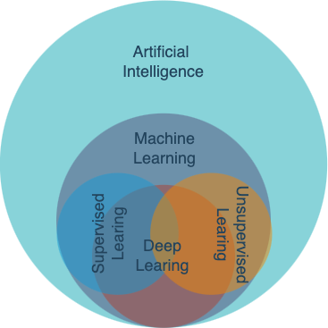

+++
title = 'A brief summary of machine learning'
date = 2023-11-18T17:36:18+01:00
draft = false
+++


We are now in a rapidly evolving world filled with thrilling challenges and boundless opportunities. Each of us has the potential to be an observer, participant, or even a catalyst in this dynamic environment. As one of its components, I aim to write a summary to distill the machine learning knowledge acquired during my master's studies in Digital Business at the University of Amsterdam. The textbook we used is [Data Science for Business What You Need to Know about Data Mining and Data-Analytic Thinking](https://www.google.nl/books/edition/Data_Science_for_Business/EZAtAAAAQBAJ?hl=en&gbpv=0) by [Foster Provost](https://fosterprovost.com/) and [Tom Fawcett](https://www.researchgate.net/profile/Tom-Fawcett).

With my understanding only touching the surface of the profound and ever-evolving field of machine learning, this summary only provides a concise overview without delving too deeply into the intricacies of algorithms. I aspire that through articulating this summary, my grasp of the subject matter will be further solidified. It would also be immensely gratifying if the words penned here have the potential to resonate with those who chance upon this page, catalyzing their burgeoning interest in the expansive realm of artificial intelligence.

If you notice any errors or want to have some further discussions with me, please feel free to drop me a message through the listed contact information. 

Now, let's get started! 


<!--
Table of content
├── overview             
│   ├── CRISP-DM  
│   └── basic machine learning intros
│       ├── definition of supervised and unsupervised ml
│       └── examples with specific algorithms
│       └── summary chart
├── unsupervised ml
│   ├── general intro with examples
│   └── KNN
├── supervised ml
│   ├── general intro with examples
│   └── intro of supervised ml algorithms
│        └──K-means
│        └──DT
│        │  └── entropy and Gini
│        └──SVM
│        └──Performance evaluation
│        └──Text mining (Beyesian)
-->
## 1. What Is Machine Learning

Nowadays, the phrases ***artificial intelligence (AI)*** and ***machine learning (ML)*** have become pervasive in daily discourse. While these terms are often used interchangeably, delving into the subtleties between them can offer valuable insights.

Artificial intelligence, as the term suggests, encompasses "artificial" or machine-based capabilities designed to emulate "intelligence". The usage of AI spans diverse domains and applications. Generally, AI can be categorized into weak AI and strong AI. Weak AI relies on robust computational power, employing 'brute force' methods to address specific tasks or objectives. In contrast, strong AI embodies technologies with inherent 'self-learning' capabilities, designed for broader and more generalized applications.

The term ***machine learning*** was introduced by [Arthur Samuel](https://en.wikipedia.org/wiki/Arthur_Samuel_(computer_scientist)) in 1959. Positioned as a sub-discipline of artificial intelligence, machine learning concentrates on formulating and scrutinizing statistical algorithms adept at effective generalization. These algorithms can autonomously execute tasks without explicit instructions and refine their performance through self-learning over time [^1].

Machine learning algorithms exhibit diverse characteristics, allowing for classification based on various criteria. A prevalent classification method involves categorizing them into supervised learning, unsupervised learning, and reinforcement learning. In supervised learning, datasets include labeled training data (e.g., yes or no), primarily utilized for predicting and classifying unseen data. Conversely, unsupervised learning algorithms uncover patterns in unlabeled data, often applied in clustering or dimensionality reduction.

Additionally, the distinction between deep learning and classical (or "non-deep") machine learning depends on the learning approach employed. Deep learning processes raw, unstructured data (e.g., text or images), autonomously discerning features that differentiate data categories. On the other hand, classical machine learning relies more on human intervention for learning [^2].
<!--

  
  
<em>Figure 1: Artificial Intelligence and Machine Learning</em>

-->

  <em>Figure 1: Artificial Intelligence and Machine Learning</em>
  

[Figure 1.1](aiml.png) illustrates the intricate interplay among the aforementioned terms and this summary will emphasize the supervised and unsupervised learning within the broader landscape of classical machine learning.

## 2. Delving into Unsupervised Machine Learning
Unsupervised learning operates without a predefined objective or target. Tasks such as ***clustering***, ***co-occurrence grouping***, and ***profiling*** typically fall under the realm of unsupervised learning. Since the outcomes of unsupervised learning may lack immediate clarity or apparent significance, it would require creativity and business acumen for interpretation.

In the following section, I will delve into the concept of ***similarity***, a fundamental principle that underpins one of the most prevalent techniques in unsupervised data mining: clustering. Subsequently, I will illustrate***K-means***, a representative algorithm that employs this method.

### 2.1 Clustering and Similarity 

***Clustering*** attempts to find natural groupings in the data by their similarity. Several distance measurement methods are commonly used for calculating similarity in clustering. These methods quantify the dissimilarity or similarity between data points within a dataset. Table 2.1 shows some commonly employed distance metrics in clustering.

- **Euclidean Distance** 
  Calculates the straight-line distance between two points in Euclidean space.
- **Manhattan Distance** 
  Measures the distance as the sum of the absolute differences between the coordinates of two points.
- **Cosine Similarity** 
  Measures the cosine of the angle between two vectors, providing a measure of similarity for non-negative values.
- **Jaccard Similarity Coefficient** 
  Evaluates the similarity between two sets by dividing the size of their intersection by the size of their union.

There are two common clustering structures. The first one is ***hierarchical clustering***, it groups the points by their similarity, and the only overlap is when one cluster contains other clusters. The most general level is a single cluster containing everything. Hierarchical clustering creates a collection of ways to group the points. An advantage is that it allows
the data analyst to see the ´groupings´ before deciding on the number of clusters to extract. For hierarchical clustering, the distance between clusters is considered. Individual instances are considered as the smallest clusters. This is also called the linkage function. It could be, for ex., the
Euclidean distance between the closest points in each of the clusters. Another way to use clustering is by clustering around centroids. Each cluster is represented by its ´cluster centre´ or centroid. The centroid is not necessarily one of the instances; it’s the geometric centre of the group! 

### 2.2 K-means Algorithm

A popular centroid-based clustering is ***k-means clustering***. The ‘means’ are the centroids, represented by the averages of the values along each attribute for the instances in the cluster. K stands for the number of clusters desired to find in the data. The K-means clustering method returns (1) the desired cluster centroids and (2) information on which of the data points belong to each cluster.

  
<em>Figure 2: Animation of K-means Clustering</em>

")
There is no guarantee a single run of k-means will result in good clustering. The result of a single clustering will find a local optimum, but will be dependent on the initial chosen centroid locations. Hence, k-means is usually run many times, starting with different random centroids each time. Results are compared by examining the clusters or the clusters’ distortion; the sum of
squared differences between each data point and its corresponding centroid. 


K-means algorithm is in general faster than hierarchical clustering.


## 3. Delving into Supervised Machine Learning
Supervised learning is model creation where the model describes a relationship between a set of selected variables (attributes/features) and a predefined variable called the target variable. Model estimates the value of the target variable as a function of the features, possibly probabilistic
function.

Supervised learning has a specific target defined (will a customer leave, can we find groups of customers with a high likelihood of churning?). For supervised data mining, there must be data on the target! The value for the target variable for an individual is often called the individual’s label. Following sections will showcase several representative supervised learning algorithms.

### 3.1 Nearest Neighbour Algorithms
***Nearest neighbour algorithms*** are often referred to as ***k-NN***. K referring to the number of neighbours. The principle of K-NN is to perform prediction tasks by calculating explicitly the similarity between a new example and a set of training examples (When k is increased to the maximum possible (k = n), the entire dataset would be used. There are three ways of 

- **Using classification**
  A situation where 2 neighbours are ‘yes’ and 1 neighbour is ‘no’, the sample
would belong to the ‘Yes’ class.
- **EUsing probability estimation**
  A situation where 2 neighbours are ‘yes’ and 1 neighbour is ‘no’, the
sample would belong to the ‘Yes’ class with a 2/3 probability.
- **Using regression**
  A situation with 3 neighbours with an income of 50, 35 and 40 thousand. What will be the income of the sample? You can use average (42) or the median (40). Though 3 neighbours is a small set.


Despite both containing a "K" in the name, KNN and K-means are fundamentally different in their learning paradigms (supervised vs. unsupervised) and their primary tasks (classification/regression vs. clustering).


### SVM

### Decision Tree

#### Entropy and Gini

### NLP

### Performance Evaluation

## Machine Learning Used Cases

## Cross-industry Standard Process for Data Mining Model
Cross-industry standard process for data mining (CRISP-DM)
As a data scientist in business, we might always want to bridge the business and data world. CRISP-DM is the most commonly used model that describes the process of data mining [^9].

## Using Supervised Machine Learning Algorithms for Housing Prediction

 summary 

 artificial intelligence 

 machine learning 

[^1]: Koza, J. R., Bennett, F. H., Andre, D., & Keane, M. A. (1996). Automated design of both the topology and sizing of analog electrical circuits using genetic programming. Artificial intelligence in design’96, 151-170.
[^2]: <https://www.ibm.com/topics/machine-learning>
[^9]: Shearer, C. (2000). The CRISP-DM model: the new blueprint for data mining. Journal of data warehousing, 5(4), 13-22.

