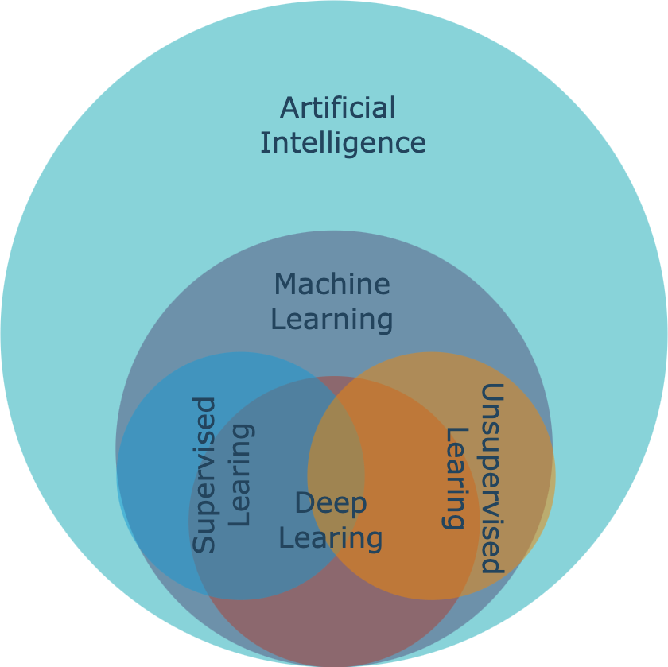

+++
title = 'A Brief Summary of Machine Learning'
date = 2023-11-18T17:36:18+01:00
draft = false
slug = 'machine-learning'
tags = ['machine learning', 'artificial intelligence', 'summary']
+++


We are now in a rapidly evolving world filled with thrilling challenges and boundless opportunities. Each of us has the potential to be an observer, participant, or even a catalyst in this dynamic process. Therefore, I am writing this summary to distill the machine learning knowledge acquired during my master's studies. The textbook we used is [Data Science for Business What You Need to Know about Data Mining and Data-Analytic Thinking](https://www.google.nl/books/edition/Data_Science_for_Business/EZAtAAAAQBAJ?hl=en&gbpv=0) by [Foster Provost](https://fosterprovost.com/) and [Tom Fawcett](https://www.researchgate.net/profile/Tom-Fawcett).

With my understanding only touching the surface of the profound and ever-evolving field of machine learning, this summary only provides a concise overview without delving too deeply into the intricacies of algorithms. I hope that through this summary, my understandings in this field will be further solidified. It would also be greatly gratifying if the words penned here have the potential to resonate with those who chance upon this page.

If you notice any errors or want to have some further discussions with me, please feel free to drop me a message :envelope:.

Now, let's get started! 


<!--
Table of content
├── overview             
│   ├── CRISP-DM  
│   └── basic machine learning intros
│       ├── definition of supervised and unsupervised ml
│       └── examples with specific algorithms
│       └── summary chart
├── unsupervised ml
│   ├── general intro with examples
│   └── KNN
├── supervised ml
│   ├── general intro with examples
│   └── intro of supervised ml algorithms
│        └──K-means
│        └──DT
│        │  └── entropy and Gini
│        └──SVM
│        └──Performance evaluation
│        └──Text mining (Beyesian)
-->
## 1. What Is Machine Learning

Nowadays, the phrases ***artificial intelligence (AI)***, ***machine learning (ML)***, and ***deep learning (DL)*** have become pervasive in daily discourse. While these terms are often used interchangeably, delving into the subtleties between them can offer valuable insights.

***Artificial intelligence***, as the term suggests, encompasses "artificial" or machine-based capabilities designed to emulate "intelligence". The usage of AI spans diverse domains and applications. Generally, AI can be categorized into weak AI and strong AI. Weak AI relies on robust computational power, employing 'brute force' methods to address specific tasks or objectives. In contrast, strong AI embodies technologies with inherent 'self-learning' capabilities, designed for broader and more generalized applications.

The term ***machine learning*** was introduced by [Arthur Samuel](https://en.wikipedia.org/wiki/Arthur_Samuel_(computer_scientist)) in 1959. Positioned as a sub-discipline of artificial intelligence, machine learning concentrates on formulating and scrutinizing statistical algorithms adept at effective generalization. These algorithms can autonomously execute tasks without explicit instructions and refine their performance through self-learning over time [^1].

Machine learning algorithms exhibit diverse characteristics, allowing for classification based on various criteria. A prevalent classification method involves categorizing them into ***supervised learning***, ***unsupervised learning***, and ***reinforcement learning***. In ***supervised learning***, datasets include labeled training data (e.g., yes or no), primarily utilised for predicting and classifying unseen data. Conversely, ***unsupervised learning*** algorithms uncover patterns in unlabeled data, often applied in clustering or dimensionality reduction.

Additionally, the distinction between ***deep learning*** and ***classical (or "non-deep") machine learning*** depends on the learning approach employed. ***Deep learning*** processes raw, unstructured data (e.g., text or images), autonomously discerning features that differentiate data categories. On the other hand, ***classical machine learning*** relies more on human intervention for learning [^2].
<!--

  
  
<em>Figure 1: Artificial Intelligence and Machine Learning</em>

-->

  <em>Figure 1. Artificial Intelligence and Machine Learning</em>
  

[Figure 1.](aiml.png) illustrates the intricate interplay among the aforementioned terms and this summary will emphasize the supervised and unsupervised learning within the broader landscape of classical machine learning.

## 2. Delving into Unsupervised Machine Learning
***Unsupervised learning*** operates without a predefined objective or target. Tasks such as ***clustering***, ***co-occurrence grouping***, and ***profiling*** typically fall under the realm of unsupervised learning. Since the outcomes of unsupervised learning may lack immediate clarity or apparent significance, it would require creativity and business acumen for interpretation.

In the following section, I will delve into the concept of ***similarity***, a fundamental principle that underpins one of the most prevalent techniques in unsupervised data mining: clustering. Subsequently, I will further illustrate ***K-means***, a representative algorithm that employs this method.

### 2.1. Clustering and Similarity 

***Clustering*** attempts to find natural groupings in the data by their similarity. Several distance measurement methods are commonly used for calculating similarity in clustering. These methods quantify the dissimilarity or similarity between data points within a dataset. Table 2.1 shows some commonly employed distance metrics in clustering.

- **Euclidean Distance** 
  Calculates the straight-line distance between two points in Euclidean space.
- **Manhattan Distance** 
  Measures the distance as the sum of the absolute differences between the coordinates of two points.
- **Cosine Similarity** 
  Measures the cosine of the angle between two vectors, providing a measure of similarity for non-negative values.
- **Jaccard Similarity Coefficient** 
  Evaluates the similarity between two sets by dividing the size of their intersection by the size of their union.

### 2.2. Hierarchical Clustering

There are two common clustering structures. The first one is ***hierarchical clustering***, which groups the points by their similarity, and the only overlap is when one cluster contains other clusters. The most general level is a single cluster containing everything. Hierarchical clustering creates a collection of ways to group the points. An advantage is that it allows the data analyst to see the *groupings* before deciding on the number of clusters to extract. For hierarchical clustering, the distance between clusters is considered. Individual instances are considered as the smallest clusters. This is also called the linkage function. It could be, for ex., the Euclidean distance between the closest points in each of the clusters. Another way to use clustering is by clustering around centroids. Each cluster is represented by its ´cluster centre´ or centroid. The centroid is not necessarily one of the instances; it’s the geometric centre of the group! 

### 2.3. K-means Clustering

A popular clustering algorithm is ***K-means clustering***. The *means* are the centroids, represented by the averages of the values along each attribute for the instances in the cluster. K stands for the number of clusters desired to find in the data. The K-means clustering method returns (1) the desired cluster centroids and (2) information on which of the data points belong to each cluster.

  
<em>Figure 2. Animation of K-means Clustering</em>

")
There is no guarantee a single run of k-means will result in good clustering. The result of a single clustering will find a local optimum, but will be dependent on the initial chosen centroid locations. Hence, k-means usually run many times, starting with different random centroids each time. Results are compared by examining the clusters or the clusters’ distortion; the sum of squared differences between each data point and its corresponding centroid. 


K-means algorithm is in general faster than hierarchical clustering.


## 3. Delving into Supervised Machine Learning
The most significant difference between supervised learning and unsupervised learning positions at whether there is a specific predefined variable called the target variable or not (e.g., will a customer churn, will an employee leave). The common task for supervised machine learning algorithms is to estimate (predict/classify) the target variable by analysing relationships between a set of selected variables (attributes/features).

The following sections will showcase several representative supervised learning algorithms.

### 3.1. Nearest Neighbour Algorithms
***Nearest neighbour algorithms*** are often referred to as ***k-NN***. K referring to the number of neighbours. The principle of K-NN is to perform prediction tasks by calculating explicitly the similarity between a new example and its K neighbours. When k is increased to the maximum possible, the entire dataset would be used. There are generally three ways of measuring the classification.

- **Using classification**: A situation where 2 neighbours are ‘yes’ and 1 neighbour is ‘no’, the sample would belong to the ‘Yes’ class.
- **Using probability estimation**: A situation where 2 neighbours are ‘yes’ and 1 neighbour is ‘no’, the
sample would belong to the ‘Yes’ class with a 2/3 probability.
- **Using regression**: A situation with 3 neighbours with an income of 50, 35 and 40 thousand. You can expect the income of the sample to be the average (42) or the median (40). 


Despite both containing a "K" in the name, KNN and K-means are fundamentally different in their learning paradigms (supervised vs. unsupervised) and their primary tasks (classification/regression vs. clustering).


### 3.2. Decision Tree
Decision tree is a hierarchical model for predicting variable of interest by spliting the sample into various pure segments. The word "tree" in its name originates from the final look of visualised decision tree model. There are three basic elements in decision tree model, namely branch, node, and path.

  
<em>Figure 3. Decision Tree Structure</em>

In a decision tree, a node represents a decision point about a certain feature. There are two main types of nodes: internal nodes and leaf nodes. Internal nodes are where a decision is made based on a particular feature; leaf nodes represent the final outcome or the predicted class.

A branch is a connection between two nodes in a decision tree, each branch represents a possible outcome or value of the feature being tested.

A path in a decision tree is a route from the root node to a specific leaf node. The path followed determines the final prediction or classification for a particular instance.

The fundamental steps for constructing a decision tree can be summarized as follows:
1. Establish the root node.
2. Identify the optimal splitting attribute.
3. Extend branches from the root node, segregating the data into mutually exclusive subsets.
4. Iteratively apply steps 2 and 3 to each leaf node until the stopping criteria are satisfied.

#### 3.2.1. Entropy and Information Gain
In the context of the foundational process of constructing a decision tree, an inquiry may arise regarding the identification of the optimal splitting attribute. Addressing this query involves a crucial concept known as entropy. Entropy serves as a metric of disorder applicable to a set, indicating the impurity level of a segment or subset. A value of 0 signifies the purest classification.


\\(\text{Entropy}(S) = -\sum_{i=1}^{c} p_i \cdot \log_2(p_i)\\)

Where \\(c\\) is the number of classes, and \\(p_i\\) is the proportion of instances of class \\(i\\) in the dataset \\(S\\).

The optimal splitting criteria aim to maximize the enhancement in purity through segmentation. Moreover, the segment size is also a crucial factor to consider. For instance, in a dataset comprising 1,000,000 instances, a homogeneous subset of just 2 instances would not significantly contribute to the improvement in classification performance. The improvement of entropy is defined as Information Gain, and its formula is defined as follows:


\\(\text{IG} = \text{Entropy}(S) - \sum_{v \in \text{Values}(A)} \frac{|S_v|}{|S|} \cdot \text{Entropy}(S_v)\\)

Where \\(S\\) is the total dataset, \\(A\\) is the selected attribute.
- \\(\text{IG}\\) denotes the measure of Entropy reduction in a dataset.  
- \\(\text{Entropy}(S)\\) measures impurity or disorder before splitting.  
- \\(\sum_{v \in \text{Values}(A)}\\) means the sum over all possible values of the attribute \\(A\\), aggregating contributions from each value. 
- \\(\frac{|S_v|}{|S|}\\) is the ratio of the number of instances in subset \\(S_v\\) to the total number of instances in dataset \\(S\\). 
- \\(\text{Entropy}(S_v)\\) is the Entropy of the subset \\( S_v\\), corresponding to a specific value of attribute \\(A\\), measuring impurity or disorder within that subset.

#### 3.2.2. Overfitting and Underfitting
Another question that may arise during the development of a decision tree is: when should I stop?

In a classification task, it is not necessarily advantageous to continue splitting nodes until they are entirely pure. Doing so would lead to a model that is overly complex, fitting the training data so closely that it struggles to generalize effectively to new, unseen data. This phenomenon is referred to as overfitting.

Underfitting, on the other hand, occurs when a model is too simple to capture the underlying patterns in the data. It fails to learn the complexities of the training data and, as a result, performs poorly on both the training set and new, unseen data. An underfit model may overlook important relationships, leading to suboptimal predictions.

Balancing between overfitting and underfitting involves finding the right level of model complexity and ensuring that the model generalizes well to new, unseen data. This process is often referred to as finding the "sweet spot" or achieving the right balance in model training.

  
<em>Figure 4. A Fitting Graph for Tree Induction</em>

### 3.3. Bayesian Classifiers
A Bayesian classifier is a probabilistic model that uses Bayes' theorem to classify instances into different classes. Bayes' theorem is based on prior knowledge of conditions that might be related to the event[^3].
Bayes' Theorem is as follows[^4]:


\\(P(A ∣ B) = \frac{P(B ∣ A) \cdot P(A)}{P(B)}\\)

where \\(A\\) and \\(B\\) are events.
- \\(P(A ∣ B)\\) is the posterior probability of class \\(A\\) given evidence \\(B\\).
- \\(P(B ∣ A)\\) is the likelihood of evidence \\(B\\) given class \\(A\\).
- \\(P(A)\\) is the prior probability of class \\(A\\).
- \\(P(B)\\) is the probability of evidence \\(B\\).

Considering \\(H\\) as the hypothesis we are interested in assessing the likelihood of, and \\(E\\) as the prior evidence we have observed, we can rename \\(A\\) to \\(H\\) for hypothesis and \\(B\\) to \\(E\\) for evidence. Therefore:


\\(P(H ∣ E) = \frac{P(E ∣ H) \cdot P(H)}{P(E)}\\)

In a real-world scenario, we may be interested in calculating the probability that the target variable \\(C\\) takes on a specific class \\(c\\) after considering the evidence \\(E\\). And oftentimes, the evidence comprises multiple features denoted as \\(E_n\\). In this context, we articulate the hypothesis \\(H\\) as \\(C = c\\) and utilize \\(E_n\\) to represent distinct sets of evidence. Therefore:


\\(P(C = c ∣ E_1, \ldots,E_n) = \frac{P(E_1, \ldots,E_n ∣ C=c) \cdot P(C=c)}{P(E_1, \ldots,E_n)}\\)

To further simplify the probability computations, Naïve Bayes assumes that all features in
\\(E\\)  are mutually independent, conditional on the category \\(C\\). Under this assumption,


\\(P(E_1, E_2, \ldots, E_n | C = c) = P(E_1 | C = c) \cdot P(E_2 | C = c) \cdot \ldots \cdot P(E_n | C = c)\\)

Therefore: 


\\(P(C = c ∣ e_1, \ldots, e_n) = \frac{P(e_1 | C = c) \cdot P(e_2 | C = c) \cdot \ldots \cdot P(e_n | C = c)}{P(e_1) \cdot P(e_2) \cdot \ldots \cdot P(e_n)}\\)

To measure how much more prevalent the evidence is in the selected subpopulation (C = c) over the prevalence in the population as a whole. A new concept lift is defined as: 


\\(lift_c(E) = \frac{P(E ∣ C)}{P(E)}\\)

Therefore, the Naïve Bayes Theorem can finally be expressed as: 


\\(P(C = c | E) = P(C = c) \cdot \text{lift}_c(e_1) \cdot \text{lift}_c(e_2) \cdot \ldots \cdot \text{lift}_c(e_n)\\)

When being applied as classifier, where the goal is to assign an instance to one of several predefined classes. The classifier calculates the posterior probability of each class given the observed features and assigns the instance to the class with the highest probability.


\\(\text{argmax}_{c} P(c | e_1, e_2, \ldots, e_n)\\)

### 3.4. Performance Evaluation
It’s challenging to link a model back to real life deployment. There are various common issues and themes in evaluation, and frameworks and techniques for dealing with them. To asses the generalization performance, various evaluation metrics were developed.

Widely used metrics include accuracy, recall, and precision. The definitions of these metrics are as follows: 


\\(\text{Accuracy} = \frac{TP + TN}{TP + TN + FP + FN}\\)


\\(\text{Recall} = \frac{TP}{TP + FN}\\)


\\(\text{Precision} = \frac{TP}{TP + FP}\\)


\\(\text{F1 Score} = 2 \times \frac{\text{Precision} \times \text{Recall}}{\text{Precision} + \text{Recall}}\\)

Where: 
- \\(\textit{TP}\\) refers to true positives, representing instances where the model accurately identifies the positive class (e.g., accurately identifying 1 as 1).
- \\(\textit{TN}\\) indicates true negatives, in which case the model precisely detects the negative class (e.g., accurately classifying 0 as 0). 
- \\(\textit{FP}\\) means false positives, denoting scenarios where the model wrongly classifies the positive class in cases where the actual class is negative (e.g., incorrectly labelling a 0 as 1).
- \\(\textit{FN}\\) indicates false negatives, indicating the model incorrectly classifies the negative class when the actual class is positive (e.g., wrongly categorizing a 1 as 0).

## 4. Machine Learning Using Cases

## 4.1. Cross-industry Standard Process for Data Mining Model
To build machine learning models into real-world usage, a widely adopted framework for data mining process is Cross-Industry Standard Process for Data Mining (CRISP-DM) methodology. Comprising six phases in total, CRISP-DM begins with understanding the business objectives and data, followed by data preparation, modeling, evaluation, and deployment. The iterative nature of CRISP-DM allows for revisiting and refining each phase, ensuring alignment with business goals. From defining project objectives and exploring datasets to deploying and refining models into operational processes, CRISP-DM promotes a structured and collaborative approach, making it adaptable to various industries and providing a robust foundation for successful data mining projects[^9].

  
<em>Figure 4. Cross-industry Standard Process for Data Mining</em>

This concludes the summary. To enhance your understanding, it is recommended to apply these models in real-world scenarios through exercises. Common machine learning projects, such as customer segmentation, housing price prediction, sentiment analysis, etc., offer valuable hands-on experience. For additional machine learning-related projects, please refer to the [Projects](https://anhui-gui.com/projects/) page.
<!--
## 4.2. Using Supervised Machine Learning Algorithms for Housing Prediction
This section showcases the application of supervised machine learning algorithms for housing prediction, a real-world scenario, to make the above theories more vivid and tangible. Leveraging advanced computational techniques, supervised learning methods harness labeled datasets to train models capable of making predictions and uncovering patterns within housing-related data. From predicting property prices to assessing market trends and optimizing decision-making processes, these algorithms offer valuable insights into the dynamic and multifaceted realm of real estate. The linked article explores the methodologies, considerations, and key principles underpinning the implementation of supervised learning in the context of housing prediction, aiming to provide a comprehensive understanding of how these powerful tools contribute to data-driven analyses and informed decision-making within the housing domain.
-->


 artificial intelligence 

 machine learning 

 summary 

[^1]: Koza, J. R., Bennett, F. H., Andre, D., & Keane, M. A. (1996). Automated design of both the topology and sizing of analog electrical circuits using genetic programming. Artificial intelligence in design’96, 151-170.
[^2]: <https://www.ibm.com/topics/machine-learning>
[^3]: Joyce, J. (2003). Bayes’ theorem.
[^4]: Stuart, A., & Ord, K. (2010). Kendall's advanced theory of statistics, distribution theory (Vol. 1). John Wiley & Sons.
[^9]: Shearer, C. (2000). The CRISP-DM model: the new blueprint for data mining. Journal of data warehousing, 5(4), 13-22.
